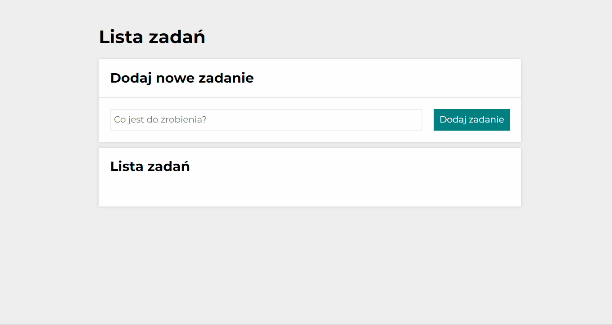

# To Do List

This is my third project on FrontEnd Dev course with YouCode. It's a simply TO DO List where you can add a task, mark it as done or delete it.

#Demo
https://boaneta.github.io/to-do-list/

#Languages and conventions used in the project
- HTML
- Normalize
- BEM
- CSS (Flex, Grid)
- JavaScript
- ES6+ features
